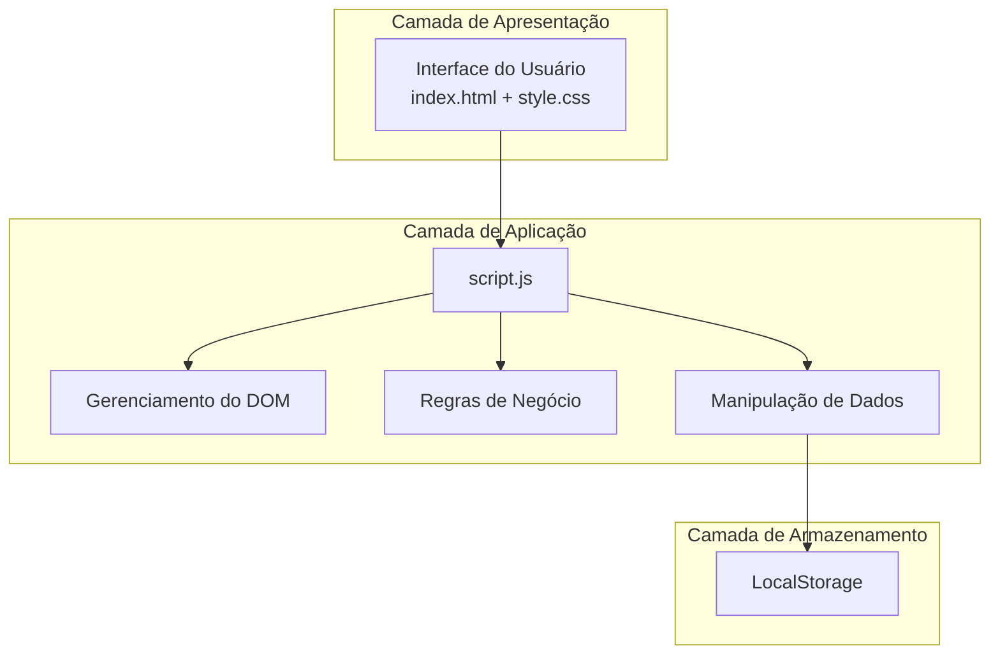

# Arquitetura do Sistema - NoteStack

## 1. Descrição da Arquitetura

O NoteStack adota uma Arquitetura Monolítica Baseada no Cliente (Client-Side Monolith) organizada em camadas lógicas. Toda a aplicação é executada no navegador do usuário, sem servidor de aplicação ou banco de dados remoto.

A arquitetura é composta por três camadas principais:

Camada de Apresentação: responsável pela interface gráfica, composta pelos arquivos index.html e style.css, que definem a estrutura, aparência e interação visual da aplicação.
Camada de Aplicação: implementada pelo arquivo script.js, concentra toda a lógica da aplicação, incluindo o gerenciamento do DOM, tratamento de eventos, validações, regras de negócio e manipulação dos dados.
Camada de Persistência: utiliza o LocalStorage do navegador para armazenar as notas localmente, permitindo que os dados permaneçam disponíveis mesmo após o fechamento da página.

Como todas essas responsabilidades estão reunidas em um único projeto executado no navegador, a aplicação caracteriza-se como um monólito cliente (Client-Side Monolito)

## 2. Justificativa Técnica

A arquitetura escolhida é adequada ao escopo do NoteStack por se tratar de uma aplicação de pequeno porte, desenvolvida inteiramente para execução no navegador.

Os principais motivos da escolha são:

simplicidade de implementação e manutenção;
ausência de necessidade de um servidor ou banco de dados externo;
rápida execução, pois todas as operações ocorrem localmente no navegador;
facilidade de implantação, sendo necessário apenas disponibilizar os arquivos estáticos da aplicação;
utilização do LocalStorage para persistência dos dados sem dependência de infraestrutura adicional.

Embora essa arquitetura possua limitações de escalabilidade e dificulte a separação de responsabilidades em projetos maiores, ela atende plenamente aos requisitos do NoteStack, oferecendo uma solução simples, eficiente e de fácil manutenção.

## 3. Diagrama de Componentes (Mermaid)


```

## 4. Limitações Estruturais Identificadas (Motivação para as Melhorias)

- Violação do Princípio de Responsabilidade Única (SRP): O arquivo script.js acumula funções de exibição visual, lógica de criação/exclusão e tratamento de dados.
- Alto Acoplamento: A lógica de negócio está amarrada aos elementos do HTML. Alterações na interface podem quebrar o comportamento do sistema.
- Persistência Rígida: O sistema conversa diretamente com a API do localStorage. Caso seja necessário migrar para um banco de dados em nuvem, todo o código do sistema precisará ser alterado.