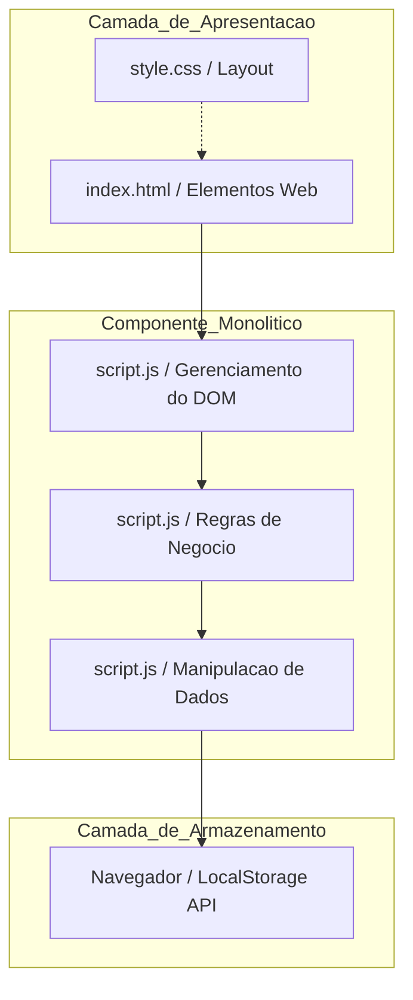

# Arquitetura do Sistema - NoteStack

## 1. Descrição da Arquitetura
O NoteStack adota uma **Arquitetura Monolítica de Camada Única Baseada no Cliente (Client-Side Monolith / Single-Tier)**. 

Diferente de sistemas web tradicionais, o NoteStack executa 100% de sua lógica operacional diretamente no navegador do usuário. O ecossistema do projeto é composto por três arquivos principais na raiz:
* `index.html`: Responsável pela estrutura estática e declaração dos elementos da interface.
* `style.css`: Responsável pela estilização visual e layout responsivo.
* `script.js`: O núcleo monolítico que centraliza a captura de eventos, as regras de negócio e a persistência.

## 2. Justificativa Técnica
A escolha por essa abordagem no escopo original justifica-se pela simplicidade do software (um bloco de notas rápido). A eliminação de um backend dedicado traz vantagens como:
1. **Latência Zero:** Não há requisições de rede (HTTP) para salvar as notas, tornando a experiência instantânea.
2. **Custo de Infraestrutura Nulo:** O sistema não exige servidores ativos ou custos com hospedagem de bancos de dados.
3. **Simplicidade de Implantação:** O projeto consiste apenas em arquivos estáticos, facilitando o deploy e a execução local.

## 3. Diagrama de Componentes (Mermaid)

## 4. Limitações Estruturais Identificadas (Motivação para as Melhorias)

- Violação do Princípio de Responsabilidade Única (SRP): O arquivo script.js acumula funções de exibição visual, lógica de criação/exclusão e tratamento de dados.
- Alto Acoplamento: A lógica de negócio está amarrada aos elementos do HTML. Alterações na interface podem quebrar o comportamento do sistema.
- Persistência Rígida: O sistema conversa diretamente com a API do localStorage. Caso seja necessário migrar para um banco de dados em nuvem, todo o código do sistema precisará ser alterado.